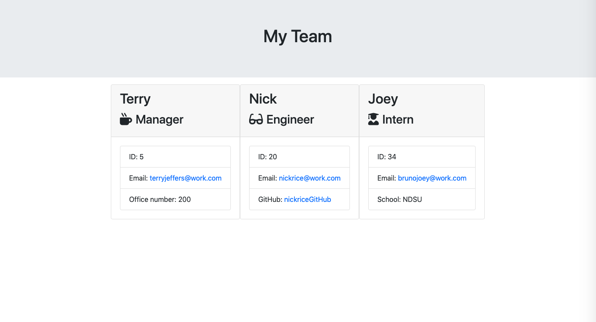

# Employee Summary

## Table of Contents
[Description](#description)
[Author(s)](##author(s))
[Installation](##installation)
[Usage](##usage)
[License](##license)
[Contributing](##contributing)
[Application In Use](##application-in-use)

## Description
This employee application helps you create your employee database into a HTML document with the help of various prompts that include an Intern, an Engineer, and a Manager. Each different type of worker has a question specific to them. After answering these various question prompts the application will generate the HTML document and put each worker you created into their own separate card. 
    
## Author(s)
Joey Bruno

## Installation
To install this application you clone the SSH Key from the main hub page of this repository and you paste that clone link into your Terminal.
    
## Usage
To use this application you run the app.js file with 'node app.js'. After, you will answer questions based on your project.

## License
MIT

## Contributing
To contribute, clone this repository into your terminal, work on the project, then create a pull request.

## Application in Use
